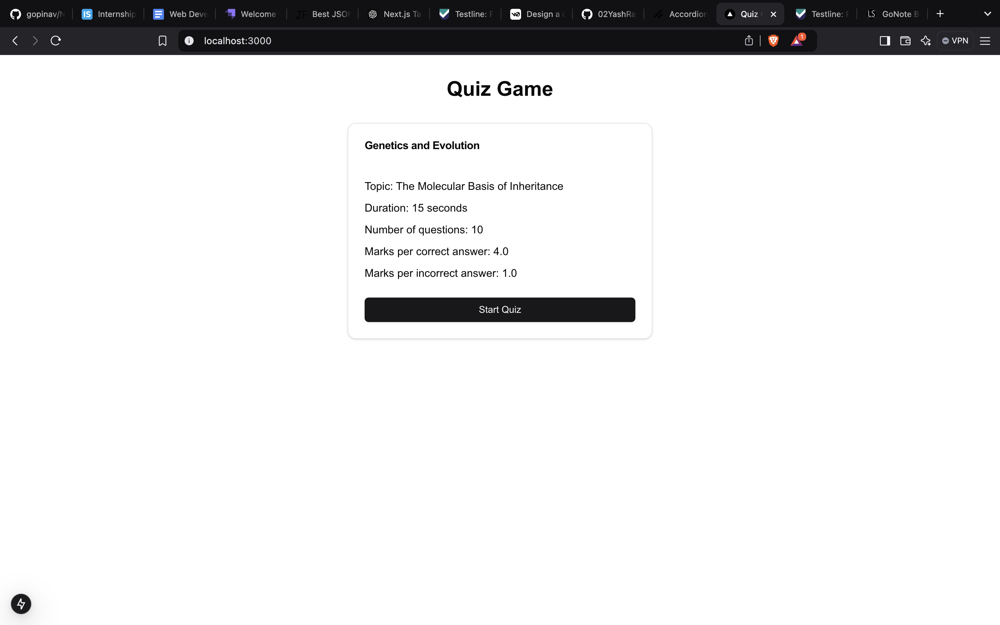
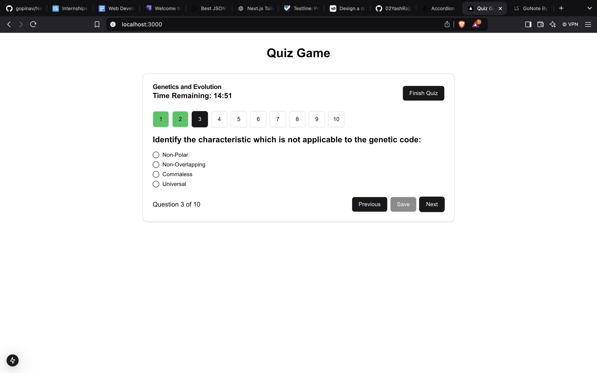
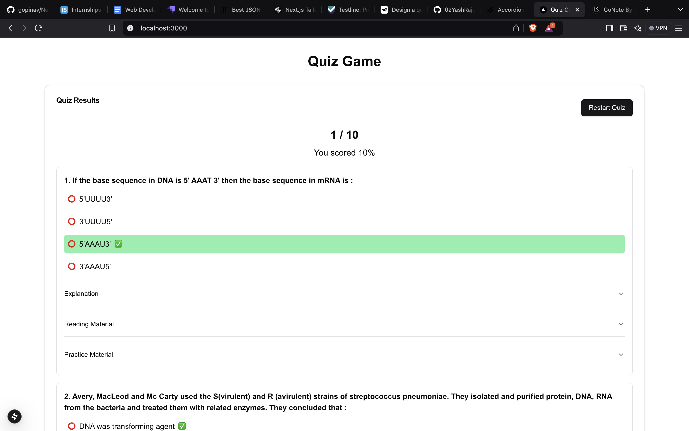

# Testline Assignment: Quiz Application

This is a Next.js project created as part of the Testline assignment. The application allows users to take a quiz with various questions, providing a quiz-like structure to assess user knowledge.

## Features
- **Next.js** for server-side rendering and static site generation.
- **Tailwind CSS** for utility-first CSS styling.
- **TypeScript (TSX)** for type-safe development.
- **App Router** for routing.
- **Quiz Structure** that includes multiple-choice questions, timers, and results.

## Requirements

Before getting started, make sure you have the following installed:

- Node.js >= 16.8
- npm (or yarn)
- A code editor like [VSCode](https://code.visualstudio.com/)

## Installation

1. Clone the repository to your local machine:

   ```bash
   git clone https://github.com/your-repository/testline-quiz.git
   cd testline-quiz
    ```

2. Install the dependencies:

   ```bash
   npm install
   ```

3. Development
To start the development server, run the following command:

    ```bash
    npm run dev
    ```

4. Build
To build the application, run the following command:

    ```bash
    npm run build
    ```

5. Production
To run the application in production mode, run the following command:

    ```bash
    npm run start
    ```


## Screenshots

### Landing Page
This is how the landing page looks when you first access the application.



### Quiz Question Page
This is the page where users see questions and answer choices during the quiz.



### Result Page
After completing the quiz, users are shown their results on this page.




